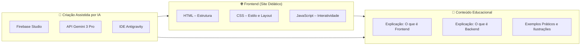

# 📚 Diferença entre Backend e Frontend no Desenvolvimento Web  
### 🏫 Trabalho de Conclusão de Curso – E.E.E.M. Dr. Solon Tavares  
### 👨‍🎓 Autor: Ricardo Quadros


Este repositório contém o projeto do meu **Trabalho de Conclusão de Curso (TCC)**, cujo objetivo é **explicar de forma didática a diferença entre Backend e Frontend no desenvolvimento web**.  
Para isso, desenvolvi um **site educacional**, com conteúdo visual, exemplos práticos e explicações acessíveis para estudantes iniciantes.

O desenvolvimento foi realizado com auxílio de **Firebase Studio** e integração da **API do Gemini 3 Pro**, junto com refinamentos feitos na **IDE Antigravity**.

---

# 🎯 Objetivo do Projeto

O projeto busca:

- Ensinar o que é **Frontend**  
- Ensinar o que é **Backend**  
- Demonstrar como eles se conectam  
- Explicar tecnologias reais utilizadas em cada camada  
- Ajudar iniciantes a visualizar o funcionamento completo de um sistema web  
- Servir como apoio didático para o TCC  

O site foi criado para ser **simples, intuitivo e educativo**.

---

# 🛠 Tecnologias Utilizadas

### 🌐 **Frontend**
- **HTML5** – Estrutura do conteúdo  
- **CSS3** – Estilo e design visual  
- **JavaScript** – Lógica e interatividade  

### 🤖 **Ferramentas de Desenvolvimento e Criação**
- **Firebase Studio** – Plataforma usada para gerar o projeto via prompts  
- **Gemini 3 Pro API** – IA utilizada para geração de conteúdo, exemplos e refinamento  
- **Antigravity IDE** – Usada para revisar, ajustar e finalizar o site  
- **Git & GitHub** – Controle de versão e publicação  

---

# 📘 Tecnologias Explicadas

## 🟦 O que é Frontend?
O **Frontend** é a parte visível de um site — tudo o que o usuário vê e interage.

**Inclui:**
- Layout  
- Botões  
- Texto  
- Animações  
- Navegação  

**Principais linguagens:**
- HTML  
- CSS  
- JavaScript  

---

## 🟥 O que é Backend?
O **Backend** é a parte invisível do sistema — tudo que acontece “por trás das cortinas”.

**Inclui:**
- Servidores  
- Bancos de dados  
- APIs  
- Regras de negócio  

**Principais tecnologias:**
- PHP, Python, Node.js, Java  
- MySQL, PostgreSQL, MongoDB  
- APIs REST  

---

## 🔗 Como Frontend e Backend se Conectam?
O Frontend envia requisições (pedidos) ao Backend, que responde com dados.

Exemplo básico:
- Frontend → “Quero todos os usuários!”  
- Backend → “Aqui está a lista em JSON”  

Esse fluxo é explicado visualmente no site.

---

# 🧩 Arquitetura do Sistema (Diagrama)



## 📁 Estrutura do Projeto
```bash
/Tcc
├─ index.html
├─ css/
│ └─ styles.css
├─ js/
│ └─ script.js
├─ assets/
│ └─ imagens/ilustrações
└─ README.md
```


---

## 📝 Sobre o Trabalho Acadêmico

Este site acompanha o TCC escrito, onde eu desenvolvo:

- Conceitos fundamentais  
- Comparações entre backend e frontend  
- Exemplos reais da indústria  
- Estrutura de funcionamento da web  
- Benefícios de aprender cada área  
- Como a IA ajudou na criação do conteúdo  

O objetivo é tornar o aprendizado acessível para qualquer estudante.

---

## 🧑‍💻 Autor

**Ricardo Quadros**  
- Estudante de Engenharia da Computação na UERGS  
- Técnico em Informática na Dr. Solon Tavares 
- Estagiário de Tecnologia e Informação – Prefeitura de Guaíba  
- Guaíba, RS – Brasil

---

## 📫 Contato

- GitHub: https://github.com/ricardaoquadros-jpg  
- Email: ricardaoquadros@gmail.com
- Linkedin: https://www.linkedin.com/in/ricardopquadros/
